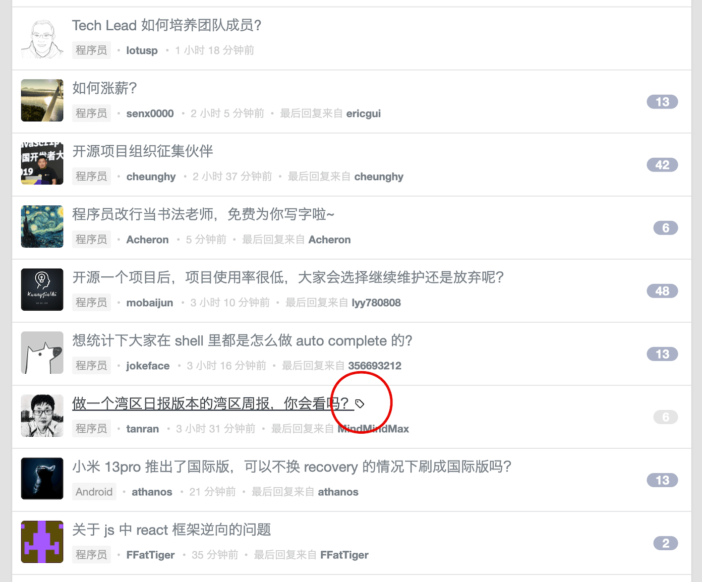
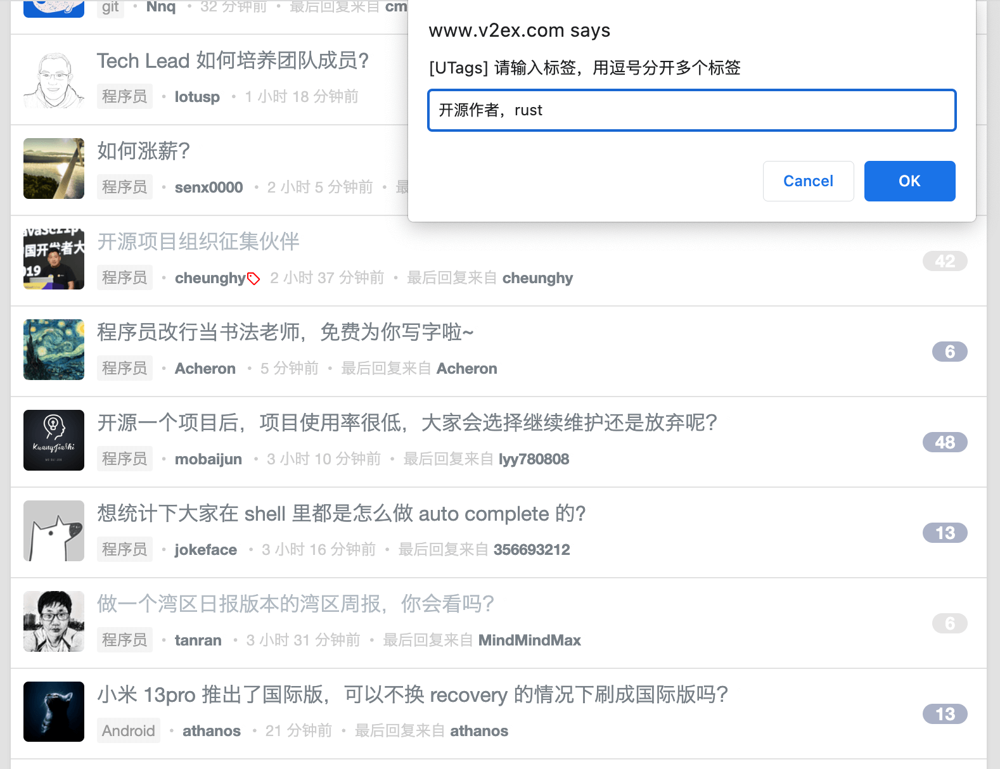
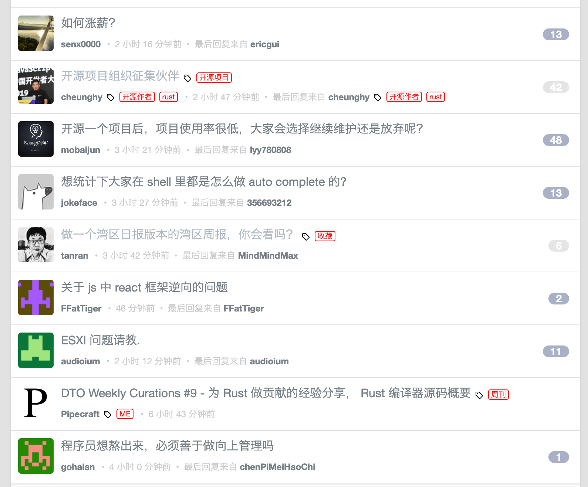

# UTags - Add usertags to links

Allow users to add custom tags to links.

## 小鱼标签 (UTags) - 为链接添加用户标签

此扩展/油猴脚本允许用户为网站的链接添加自定义标签。比如，可以给论坛的用户或帖子添加标签。

**UTags** = **Usertags**。**Userscript**, **Userstyle** 可以让用户自定义网站的功能和样式，**Usertags** 允许用户自定义网站的标签。

目前支持的网站

- www.v2ex.com
- 更多网站会陆续支持

## 安装

- 类 Chrome 浏览器: 即将上架 Chrome 商店
- Edge 浏览器: 即将上架 Edge 商店
- Firefox 浏览器: 已上架 [Firefox Addon 商店](https://addons.mozilla.org/firefox/addon/utags/)，[点击这里](https://addons.mozilla.org/firefox/addon/utags/)安装。
- 油猴脚本: [https://greasyfork.org/scripts/460718-utags-add-usertags-to-links](https://greasyfork.org/scripts/460718-utags-add-usertags-to-links)
- [手动安装浏览器扩展](manual-installation.md)

## 使用方法

- 鼠标移到帖子标题或用户名的上面，会显示标签图标。
  

- 点击标签图标，输入标签，用逗号分开多个标签。
  

- 帖子标题，用户名都可以设置标签。
  

## 功能特点

- 在浏览的页面可以直接添加标签，保存标签时不会刷新页面
- 不仅可以给用户打标签，还可以给帖子打标签
- 在标签列表页面，可以看到有标签的用户和帖子，按更新顺序排序
- 支持 Vimium 扩展，点击 'f' 键，标签图标按钮也会有提示，可以快速添加标签
- 支持数据导出、导入
- 支持导入 [v2ex user tag](https://greasyfork.org/scripts/437891-v2ex-user-tag) 油猴脚本的数据
- 除了 v2ex，以后还会支持更多的网站

### 彩蛋

- 标签设置为 'sb'，该用户的帖子或评论都会半透明显示，可以方便跳过价值低的内容
- 标签设置为 'block'，该用户的帖子或评论都会被隐藏，眼不见，心不烦
- 更多特殊标签，比如：标题党, 推广, 无聊, 忽略, 已阅, hide, 隐藏, 不再显示, 热门, 收藏, 关注, 稍后阅读

## 更新记录

## v0.1.5

- 添加更多特殊标签，比如：标题党, 推广, 无聊, 忽略, 已阅, hide, 隐藏, 不再显示, 热门, 收藏, 关注, 稍后阅读
- 修改 www.v2ex.com 匹配规则，支持更多页面，比如：提醒系统、账户余额等

### v0.1.4

- 支持给 www.v2ex.com 节点添加标签

### v0.1.2

- 解决 Firefox 浏览器不支持 'sb', 'block' 等标签的特殊功能的问题

- [更多内容](release-notes/zh-CN.md)

## Roadmap

- 扩展实现 popup, option 页面功能
- 网页内所有链接显示添加标签按钮
- 支持更多的网站：
  - Next: hacker news, lobsters, [DTO](https://dto.pipecraft.net/), P\*Hub
- 支持自定义网站规则
- 支持自定义标签样式
- [列表页](https://utags.pipecraft.net/tags/)显示用户头像
- 展示其他用户们的标签内容
- 显示在哪个页面添加的标签
- 多设备数据同步

## Getting Started

First, run the development server:

```bash
pnpm dev
# or
npm run dev
```

Open your browser and load the appropriate development build. For example, if you are developing for the chrome browser, using manifest v3, use: `build/chrome-mv3-dev`.

You can start editing the popup by modifying `popup.tsx`. It should auto-update as you make changes. To add an options page, simply add a `options.tsx` file to the root of the project, with a react component default exported. Likewise to add a content page, add a `content.ts` file to the root of the project, importing some module and do some logic, then reload the extension on your browser.

For further guidance, [visit our Documentation](https://docs.plasmo.com/)

## Making production build

Run the following:

```bash
pnpm build
# or
npm run build
```

This should create a production bundle for your extension, ready to be zipped and published to the stores.

## Submit to the webstores

The easiest way to deploy your Plasmo extension is to use the built-in [bpp](https://bpp.browser.market) GitHub action. Prior to using this action however, make sure to build your extension and upload the first version to the store to establish the basic credentials. Then, simply follow [this setup instruction](https://docs.plasmo.com/framework/workflows/submit) and you should be on your way for automated submission!

## License

Copyright (c) 2023 [Pipecraft](https://www.pipecraft.net). Licensed under the [MIT License](https://github.com/utags/utags/blob/main/LICENSE).

## >\_

[](https://www.pipecraft.net)
[](https://utags.pipecraft.net)
[](https://dto.pipecraft.net)
[](https://www.bestxtools.com)
